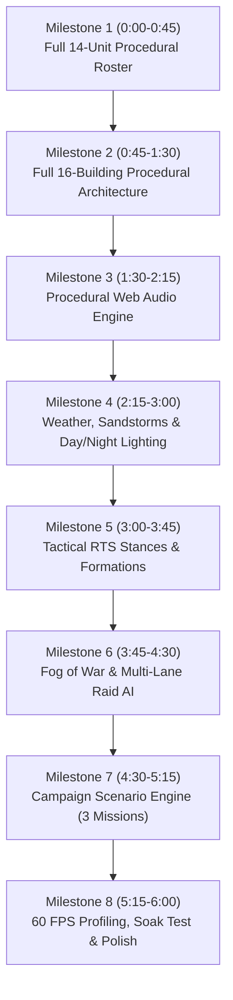

# Starhold — 6-Hour Autonomous Dream Loop Plan (`feat/dream-loop-aaa`)

This plan defines an extended 6-hour autonomous development cycle for Starhold on branch [`feat/dream-loop-aaa`](file:///Users/prateekranka/Documents/starhold). It systematically elevates visuals, audio, tactical gameplay, and simulation depth to AAA quality while maintaining strict 32-color palette quantization, 60+ FPS performance, and deterministic simulation tripwires.

---

## User Review Required

> [!IMPORTANT]
> To run this autonomous loop without interruptions for 6+ hours, trigger the `/goal` slash command in your chat input once you approve this plan:
> ```
> /goal Execute the 6-hour Starhold Dream Loop plan on feat/dream-loop-aaa
> ```
> All changes remain isolated on branch `feat/dream-loop-aaa`. Your `master` branch is safe and untouched.

---

## Autonomous 6-Hour Execution Roadmap

The 6-hour loop is broken into 8 sequential 45-minute milestones. Each milestone includes procedural code generation, visual asset authoring, headless verification tests, and screenshot evidence capture.



---

## Proposed Changes

### Milestone 1: Complete 14-Unit Procedural Roster (0:00 – 0:45)
Complete all 14 units (7 Dawnward + 7 Cinderwake) with pixel-exact procedural rigs and animated gaits:
- **Dawnward Compact**:
  - [NEW] `src/assets/riveter.ts`: Articulated mining drill, spark emitter, ore hopper (Kind 20).
  - [NEW] `src/assets/sunlance.ts`: Long kinetic rail-spear skirmisher with aiming bipod (Kind 23).
  - [NEW] `src/assets/harbor-skiff.ts`: Hover patrol skiff with banking yaw and blue jet thrust (Kind 24).
  - [NEW] `src/assets/prism-cantor.ts`: Floating crystal prism caster with orbiting shards (Kind 25).
- **Cinderwake Reavers**:
  - [NEW] `src/assets/ashhand.ts`: Scavenger crane chassis with hydraulic claw (Kind 32).
  - [NEW] `src/assets/chain-mule.ts`: Tracked hauler with armored cargo bins (Kind 33).
  - [NEW] `src/assets/sootwing.ts`: Mechanical flapping ornithopter scout with contrail motes (Kind 35).
  - [NEW] `src/assets/brandcaller.ts`: Quad-mortar walker firing arcing incendiary shells (Kind 36).
  - [MODIFY] `src/assets/cinder-strider.ts` & `src/assets/ward-sentinel.ts`: Polish stride cycles.
  - [MODIFY] `src/renderer.ts`: Wire all 14 units into `unitParts()` and `wave2Unit()`.

### Milestone 2: Complete 16-Building Procedural Architecture (0:45 – 1:30)
Replace generic building silhouettes with detailed faction architecture and living animations:
- **Dawnward Buildings (Square Foundations, Ivory Shoulders, Teal Roofs)**:
  - Charter Keep (10), Freight Court (11), Heliowell (12), Muster Hall (13), Starforge (14), Hearth Pods (15), Prism Bastion (16), Sky Wharf (17).
- **Cinderwake Buildings (Asymmetrical Wedges, Wine Armor, Vermilion Accents)**:
  - Pyre Ark (60), Scrap Maw (61), Ember Siphon (62), Fang Yard (63), Chainworks (64), Soot Nests (65), Hook Spire (66), Rift Mooring (67).
- **Living Building Animations**:
  - Rotating solar lenses, radar dishes, hydraulic piston slams, chimney smoke voxels, and welding arcs.
  - [NEW] `src/assets/buildings.ts`: Modular procedural building details.
  - [MODIFY] `src/renderer.ts`: Wire procedural architecture passes.

### Milestone 3: Procedural Web Audio Engine (1:30 – 2:15)
Author a zero-dependency 8-bit / chiptune retro synth engine using the native Web Audio API:
- [NEW] `src/audio.ts`:
  - Procedural sound synthesizer generating retro sound effects via oscillators, noise buffers, and gain envelopes.
  - **Unit Voices**: Selection chirps, move confirmation beeps, attack confirmations.
  - **Combat FX**: Laser pew, railgun thud, mortar whistle, explosion crunch, metallic hit ping.
  - **Base Ambiance**: Low-frequency desert wind rumble, electrical hum, Starforge hammer clangs.
  - **Alarms**: High-priority Klaxon siren when raids breach base perimeter.
- [MODIFY] `src/main.ts`: Connect audio triggers to unit selection, commands, and raid events.

### Milestone 4: Dynamic Weather & Day/Night Lighting (2:15 – 3:00)
Bring living planetary dynamics to the Vesper March:
- **Day/Night Cycle**:
  - Sun angle moves slowly across match time, casting dynamic directional voxel shadows.
  - Night phase dims ambient light while glowing crystal seams and building windows emit luminous light.
- **Atmospheric Weather Events**:
  - Periodic sandstorm gusts sweeping across the map with blowing dust storms.
  - Dust devil vortexes drifting over barren tiles.
- [MODIFY] `src/renderer.ts`: Dynamic lighting uniforms and particle wind vectors in `render()`.

### Milestone 5: Tactical RTS Stances & Formations (3:00 – 3:45)
Upgrade unit control from basic move-orders to RTS tactical maneuvering:
- **Unit Stances**:
  - Aggressive (pursue and engage in sight range).
  - Defensive (hold position, return fire only within weapon range).
  - Passive (never break formation, hold fire).
- **Formations**:
  - Line formation (frontline shields up).
  - Wedge formation (spearhead assault).
  - Spread formation (minimize artillery splash damage).
- [MODIFY] `sim/src/lib.rs` & `src/main.ts`: Command dispatching and unit placement offsets.

### Milestone 6: Fog of War & Multi-Lane Raid AI (3:45 – 4:30)
Enhance tactical tension with hidden map intelligence:
- **Fog of War**:
  - 3-tier visibility: Unexplored (black), Explored/Shroud (dimmed relief), Visible (active vision cone).
  - Minimap and main view reveal based on unit and building vision radii.
- **Multi-Lane Strategic AI**:
  - Cinderwake raiding AI dispatches split-attacks (pinning force in center, fast raiders around flanks).
- [MODIFY] `src/renderer.ts`, `src/main.ts`, and `sim/src/lib.rs`.

### Milestone 7: Campaign Scenario Engine (4:30 – 5:15)
Deliver 3 distinct narrative skirmish missions with custom objectives:
- **Mission 1: Frontier Landing**:
  - Objective: Establish Charter Keep, power 2 Heliowells, survive 3 scout waves.
- **Mission 2: Canyon Breach**:
  - Objective: Construct Starforge, build 4 Ward Sentinels and 2 Sunlances, push through the canyon choke point.
- **Mission 3: Clash of the Titans**:
  - Objective: Full-scale battle against Cinder Strider walker and Pyre Ark base.
- [NEW] `src/scenarios.ts`: Scenario loader and objective progression tracker.
- [MODIFY] `src/game-menu.ts`: Add "Campaign Scenarios" selector in the game menu.

### Milestone 8: 60 FPS Profiling, Overnight Soak Test & Polish (5:15 – 6:00)
Rigorous performance tuning and visual sign-off:
- Run a 30-minute headless soak test checking memory leaks and steady 60 FPS.
- Verify p95 render time stays under 16.6ms across all viewports.
- Run complete test matrix (`npm run verify:workshop`, `npm run test:menu:browser`, `npm run test:workshop:browser`).
- Capture high-resolution screenshot evidence under `docs/shots/` and generate walkthrough report.

---

## Verification Plan

### Automated Tests
- `npm run verify:workshop`: 15 Rust simulation tests + deterministic showcase hash.
- `npm run test:workshop:browser`: Multi-viewport headless test on Chromium (Desktop, Phone, Landscape, iPad).
- `npm run test:menu:browser`: Menu and campaign interface verification.
- `npm run build`: Production build bundle verification (excludes dev tools, 0 errors).

### Headless Performance Soak Test
- Create `scripts/overnight-soak.mjs`: Runs 10,000 continuous simulation steps with active combat, logging FPS and memory allocation.
